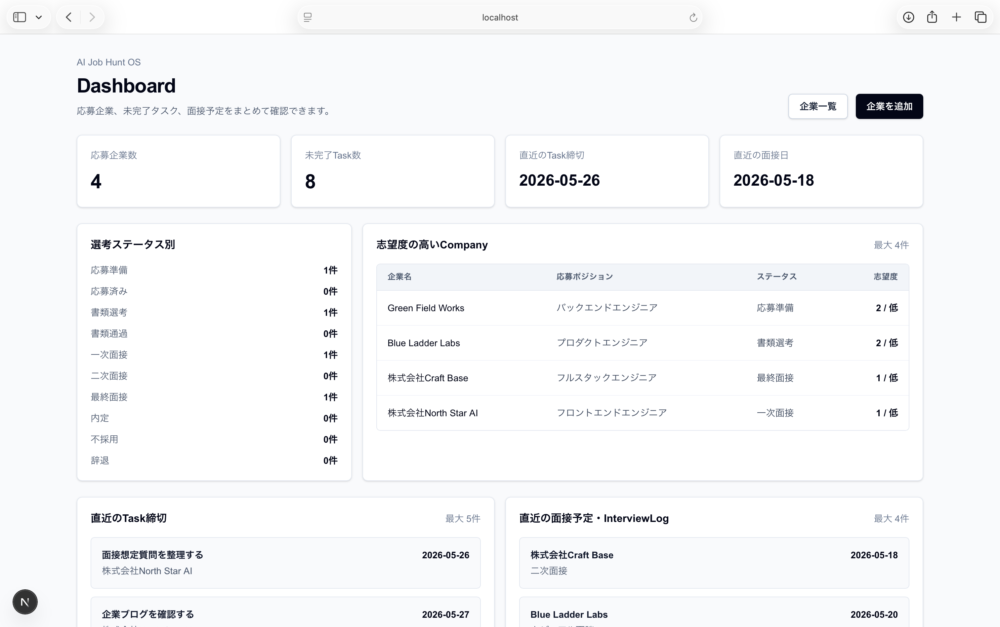
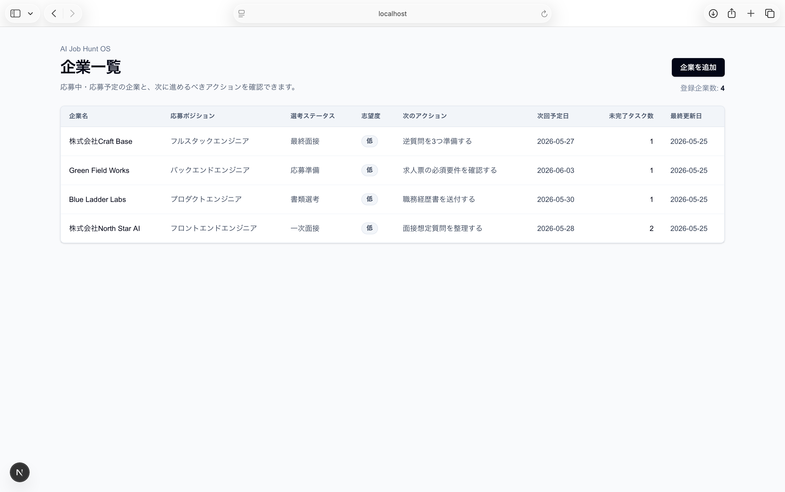
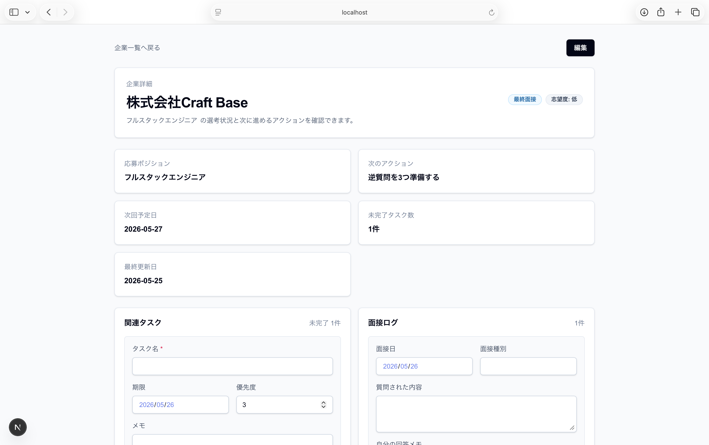

# AI Job Hunt OS


AI Job Hunt OS は、就職活動の応募状況、選考予定、タスク、面接ログを一元管理するための Web アプリです。

現在は、認証を入れる前のローカル MVP として、demo user 固定で PostgreSQL にデータを保存しながら Company / Task / InterviewLog を扱える段階です。

## 概要

就職活動では、応募先ごとの選考ステータス、面接日程、提出書類、次にやること、面接後の振り返りが複数のツールに分散しがちです。

AI Job Hunt OS では、就活に必要な情報を Company を中心に整理し、後から認証や AI 機能を追加できる土台を作ることを目指しています。

## 現在実装済みの機能

- Dashboard で DB 集計を表示
  - 応募企業数
  - 未完了 Task 数
  - 直近の Task 締切
  - 直近の面接日
  - 選考ステータス別件数
  - 志望度の高い Company
  - 直近の Task / InterviewLog
  - Task 一覧画面への導線
- Company 一覧表示
- Company 詳細表示
- Company 作成・編集・削除
- Company 詳細画面内での Task 表示・作成・完了切り替え・編集・削除
- Task 一覧画面での未完了 / 完了 Task 表示
- Task 一覧画面での完了 / 未完了切り替え
- Task 一覧画面での関連 Company へのリンク表示
- Company 詳細画面内での InterviewLog 表示・作成・編集・削除
- Prisma + PostgreSQL による DB 保存
- Docker Compose によるローカル PostgreSQL 起動
- seed による demo user とサンプルデータ投入

Task は Company 詳細画面内で作成・編集・削除でき、Task 一覧画面では demo user の全 Task を未完了 / 完了に分けて確認し、完了状態を切り替えられます。一般 Task 作成画面、Task 一覧画面からの削除、InterviewLog 一覧画面は、実装済みとは扱っていません。

## スクリーンショット

### Dashboard



DB に保存された demo user の応募状況を集計して、応募企業数、未完了 Task 数、直近の Task 締切、直近の面接日などを確認できる画面です。選考ステータス別件数や直近の Task / InterviewLog も、この画面から把握できます。

### Company 一覧



登録済み Company の一覧を確認し、詳細画面への移動や Company の新規作成につなげる画面です。現在のローカル MVP では、demo user 固定のデータを表示します。

### Company 詳細



Company の基本情報と、その Company に紐づく Task / InterviewLog をまとめて確認・更新できる画面です。Task の作成・完了切り替え・編集・削除、InterviewLog の表示・作成・編集・削除は、この詳細画面内で扱います。

## 現在未実装の機能

- 認証
- ユーザー登録・ログイン
- ログインユーザーごとのデータ分離
- AI 機能
- 一般 Task 作成画面
- `/tasks/[taskId]/edit`
- Task 一覧画面からの Task 削除
- InterviewLog 一覧画面
- 検索・フィルター
- デプロイ
- 本格的なテスト整備

現在は `demo-user` 固定で DB を読み書きしています。

## 設計上の工夫

Company を中心に Task と InterviewLog を紐づけています。就活では企業ごとに選考ステータス、次のアクション、準備タスク、面接ログが発生するため、まず Company 詳細画面で関連情報をまとめて確認・更新できる構成にしています。

また、最初から認証や AI まで広げず、モックで情報設計を確認した後に Prisma + PostgreSQL へ移行しています。これにより、応募管理の中心データと CRUD の流れを先に固めています。

Company 削除時は物理削除です。紐づく InterviewLog は削除し、Task は `companyId` を `null` にして一般タスクとして残す設計にしています。

DB 接続は Prisma 7 前提の構成です。`DATABASE_URL` は `prisma.config.ts` と `.env` で扱い、`schema.prisma` の `datasource` には `url = env("DATABASE_URL")` を書かない方針にしています。`.env.local` はローカル上書き用に使えますが、基本セットアップは `.env.example` を `.env` にコピーする手順にしています。アプリ側では `src/lib/prisma.ts` で `@prisma/adapter-pg` を使って Prisma Client を生成しています。

## 技術スタック

- Next.js 16 App Router
- React 19
- TypeScript
- Tailwind CSS
- Prisma 7
- PostgreSQL
- Docker Compose
- ESLint

今後の候補として、認証には Auth.js / NextAuth、AI 機能には OpenAI API などの利用を想定しています。

## Quick Start

必要なもの:

- Git
- Node.js / npm
- Docker / Docker Compose

ローカルでは Docker Compose で PostgreSQL を起動し、Prisma 7 + PostgreSQL に接続します。認証はまだ未実装で、現在は `demo-user` 固定のローカル MVP です。

```bash
npm install
cp .env.example .env
docker compose up -d
npx prisma generate
npx prisma migrate dev
npx prisma db seed
npm run dev
```

開発サーバー起動後、ブラウザで `http://localhost:3000` を開くと Dashboard を確認できます。

詳しい手順や確認コマンドは [docs/setup.md](docs/setup.md) を参照してください。`.env.example` の `DATABASE_URL` はローカル開発用 Docker 環境のサンプルです。実際の `.env` / `.env.local`、本番 DB や個人用 DB の接続情報、API キー、個人情報は commit しないでください。

## AI 活用方針

AI 機能はまだ未実装です。将来的には、蓄積した Company / Task / InterviewLog をもとに、面接準備、振り返り整理、次アクション提案などを補助する機能を検討します。

ただし、就活データには個人情報や応募先情報が含まれるため、AI API に渡すデータ範囲、ログ保存、認証導入後のユーザー分離を整理してから実装する方針です。

## 今後の予定

1. README / docs の継続整備
2. 一般 Task 作成画面、Task 一覧画面からの編集・削除、InterviewLog 一覧画面の検討
3. 検索・フィルターの追加
4. 認証の追加
5. ログインユーザーごとのデータ取得への切り替え
6. 本格的なテスト整備
7. デプロイ
8. AI 機能の段階的な追加

詳細な設計方針は [docs/00-project-overview.md](docs/00-project-overview.md)、現在の実装状況は [docs/02-mvp-implementation-status.md](docs/02-mvp-implementation-status.md) にまとめています。
