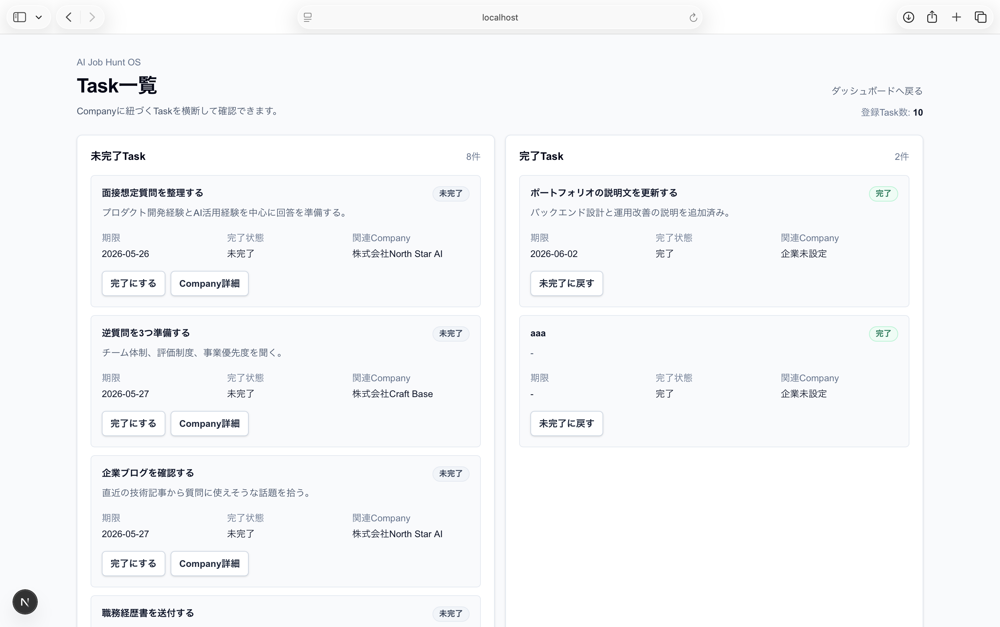

# AI Job Hunt OS


[](https://github.com/tomokitatsuda/ai-job-hunt-os/actions/workflows/ci.yml)

AI Job Hunt OS は、就職活動の応募状況、選考予定、タスク、面接ログを一元管理するための Web アプリです。

現在は v0.10.0 相当として、初回オンボーディング、認証済み CRUD とowner isolationの自動テスト、PostgreSQLを含むGitHub Actions CI、demo dataの安全方針、platform共通のproduction containerまで導入済みです。

## 概要

就職活動では、応募先ごとの選考ステータス、面接日程、提出書類、次にやること、面接後の振り返りが複数のツールに分散しがちです。

AI Job Hunt OS では、就活に必要な情報を Company を中心に整理し、認証ユーザーごとのデータ管理や将来の AI 機能につなげられる土台を作ることを目指しています。

## 現在実装済みの機能

- Dashboard で DB 集計を表示
  - 応募企業数
  - 未完了 Task 数
  - 直近の Task 締切
  - 直近の面接日
  - 選考ステータス別件数
  - 志望度の高い Company
  - 直近の Task / InterviewLog
  - Task 一覧画面への導線
- Company 一覧表示
- Company 詳細表示
- Company 作成・編集・削除
- Company 詳細画面内での Task 表示・作成・完了切り替え・編集・削除
- Task 一覧画面での未完了 / 完了 Task 表示
- Task 一覧画面での完了 / 未完了切り替え
- Task 一覧画面での関連 Company へのリンク表示
- Task 一覧画面での Company 選択つき Task 作成
- Task 一覧画面からの Task 編集・削除・Company 紐づけ変更
- Company 詳細画面内での InterviewLog 表示・作成・編集・削除
- Prisma + PostgreSQL による DB 保存
- Docker Compose によるローカル PostgreSQL 起動
- seed による demo user とサンプルデータ投入
- Auth.js / GitHub OAuth によるサインイン基盤
- Next.js 16 Proxy による Dashboard / Company / Task 画面の認証境界
- `getCurrentUserId()` による Auth.js session user ID の取得
- Company / Task / InterviewLog / Dashboard のログインユーザー単位の owner scoping
- Company も Task もない初回ユーザー向けのオンボーディング表示
- Company 1 件と Task 2 件を安全に作るスターターデータ作成 action
- Playwright による未認証境界・認証済み CRUD・オンボーディングの E2E テスト
- Chromium / WebKit の2ブラウザで合計24件の E2E テスト
- 別ユーザーのCompany / Task / InterviewLogを表示しないowner isolation E2E
- remote DBへのseed・認証済みE2E誤実行を防ぐ安全判定とunit test
- GitHub Actions による dependency audit・migration・lint・schema検証・unit test・build・E2E の自動実行
- Next.js standalone outputによるproduction container
- non-root実行、migration専用image、DB readinessを含むcontainer smoke test
- liveness `/api/health/live` とreadiness `/api/health/ready`

Task は Company 詳細画面内で作成・編集・削除でき、Task 一覧画面ではログインユーザーの全 Task を未完了 / 完了に分けて確認し、完了状態を切り替えられます。また、Task 一覧画面の作成フォームでは Company を任意選択でき、未選択なら一般 Task、選択済みなら Company 紐づき Task として保存します。Task 編集画面では title、memo、dueDate に加えて Company の紐づけ先を変更でき、Company との紐づけ解除も可能です。

`src/proxy.ts` は `/`、`/companies/:path*`、`/tasks/:path*` を保護し、未ログイン時は Auth.js の callback URL を付けて `/login` へ redirect します。Proxy は入口での早期チェックとして使い、データ取得・更新時には引き続き `getCurrentUserId()` で `session.user.id` を確認します。ログイン後に作成した Company / Task は、その認証ユーザーの `userId` に紐づきます。

seedで作成する `demo-user` はローカル開発専用のfixtureです。通常ユーザーへ自動移行・自動コピーせず、初回体験はオンボーディングに一本化します。詳しい判断理由と、将来本物の旧データ移行が必要になった場合の条件は [docs/03-demo-data-policy.md](docs/03-demo-data-policy.md) にまとめています。

Company と Task がどちらもない場合、Dashboard に初回セットアップを表示します。ユーザーは空のまま Company を登録するか、サンプル Company 1 件、Company に紐づく Task 1 件、一般 Task 1 件を作成して、編集・削除しながら操作を学べます。既存データがあるユーザーには追加せず、所有者も現在の認証ユーザーに限定します。

## 認証後の確認

GitHub OAuthでの実ログイン／ログアウトは手動確認し、未ログイン時のredirect、認証済みCRUD、Dashboard集計、初回オンボーディング、owner isolationはPlaywrightで自動確認しています。

詳細なチェックリストは [docs/auth-verification.md](docs/auth-verification.md) にまとめています。

## スクリーンショット

### Dashboard


DB に保存されたログインユーザーの応募状況を集計して、応募企業数、未完了 Task 数、直近の Task 締切、直近の面接日などを確認できる画面です。選考ステータス別件数や直近の Task / InterviewLog も、この画面から把握できます。Company と Task がない初回ユーザーには、登録導線とスターターデータ作成を含むオンボーディングを表示します。
Dashboard には「企業を見る」「タスクを見る」「企業を追加」「タスクを追加」の導線を置いています。

### Company 一覧


登録済み Company の一覧を確認し、詳細画面への移動や Company の新規作成につなげる画面です。現在は、ログインユーザーに紐づく Company を表示します。

### Company 詳細


Company の基本情報と、その Company に紐づく Task / InterviewLog をまとめて確認・更新できる画面です。Task の作成・完了切り替え・編集・削除、InterviewLog の表示・作成・編集・削除は、この詳細画面内で扱います。

### Task 一覧



ログインユーザーの全 Task を未完了 / 完了に分けて確認できる画面です。Company に紐づく Task は関連 Company へのリンクを表示し、Company に紐づかない一般 Task は一般 Task として表示します。この画面から任意の Company を選んだ Task 作成、一般 Task 作成、完了/未完了切り替え、編集、Company 紐づけ変更、削除ができます。

## 現在未実装の機能

- AI 機能
- InterviewLog 一覧画面
- 検索・フィルター・ソート
- hosting providerの選定と実環境へのデプロイ
- GitHub OAuth の実ログインを含む外部サービス連携テスト

Auth.js / GitHub OAuth の基盤、`/login`、サインイン / サインアウト action、アプリ画面を対象にした Proxy、初回ユーザー向けスターターデータ作成フローは導入済みです。
demo-userの自動移行は未実装ではなく、データ所有権を守るため実施しない方針です。

## 設計上の工夫

Company を中心に Task と InterviewLog を紐づけています。就活では企業ごとに選考ステータス、次のアクション、準備タスク、面接ログが発生するため、まず Company 詳細画面で関連情報をまとめて確認・更新できる構成にしています。

また、最初から AI まで広げず、モックで情報設計を確認した後に Prisma + PostgreSQL へ移行し、その後 Auth.js / GitHub OAuth の基盤を追加しています。これにより、応募管理の中心データ、CRUD、ユーザー単位の owner scoping の流れを先に固めています。

ユーザー ID は `src/lib/current-user.ts` の `getCurrentUserId()` に集約しています。現在は Auth.js の `auth()` から `session.user.id` を取得し、未ログイン時は `/login` に redirect します。Proxy だけに認可を任せず、Company / Task は `userId`、InterviewLog は Company 経由で所有者確認する方針です。

Company 削除時は物理削除です。紐づく InterviewLog は削除し、Task は `companyId` を `null` にして一般タスクとして残す設計にしています。Task 一覧画面では Company 選択を任意とし、未選択なら `companyId: null`、選択した場合は owner scoping を確認した Company ID を保存します。編集時も同じ所有者確認を行います。

DB 接続は Prisma 7 前提の構成です。`DATABASE_URL` は `prisma.config.ts` と `.env` で扱い、`schema.prisma` の `datasource` には `url = env("DATABASE_URL")` を書かない方針にしています。`.env.local` はローカル上書き用に使えますが、基本セットアップは `.env.example` を `.env` にコピーする手順にしています。アプリ側では `src/lib/prisma.ts` で `@prisma/adapter-pg` を使って Prisma Client を生成しています。

## 技術スタック

- Next.js 16 App Router
- React 19
- TypeScript
- Tailwind CSS
- Auth.js / NextAuth
- @auth/prisma-adapter
- Prisma 7
- PostgreSQL
- Docker Compose
- Docker multi-stage build
- Playwright
- GitHub Actions
- ESLint

今後の候補として、AI 機能には OpenAI API などの利用を想定しています。

## Quick Start

必要なもの:

- Git
- Node.js / npm
- Docker / Docker Compose

ローカルでは Docker Compose で PostgreSQL を起動し、Prisma 7 + PostgreSQL に接続します。Auth.js / GitHub OAuth を使うため、`.env.example` を `.env` にコピーしたうえで、`AUTH_SECRET`、`AUTH_GITHUB_ID`、`AUTH_GITHUB_SECRET` をローカル環境用に設定してください。実値は commit しないでください。

```bash
npm install
cp .env.example .env
docker compose up -d
npx prisma generate
npx prisma migrate dev
npx prisma db seed
npm run dev
```

開発サーバー起動後、ブラウザで `http://localhost:3000` を開きます。未ログインの場合は `/login` に redirect され、GitHub OAuth でログイン後に Dashboard を確認できます。

## E2E test

Playwright で Chromium と WebKit を対象に、各12本、合計24本の E2E テストを実行します。各ブラウザの5本は `/login` と未ログイン時の認証境界、5本はowner isolation、初回オンボーディング、Company CRUD、Task CRUDとCompany紐づけ変更、InterviewLog CRUD、2本はliveness／DB readinessを確認します。認証済みテストは一時的な User と Auth.js Session を DB に作成し、ブラウザへセッション Cookie を設定するため、アプリ側にテスト専用の認証回避を入れていません。各テストのデータは終了時に削除します。

```bash
docker compose up -d
npx prisma migrate dev
npx playwright install chromium webkit
npm run test:e2e
```

認証境界と認証済み CRUD は個別にも実行できます。

```bash
npm run test:e2e:auth-boundary
npm run test:e2e:authenticated
npm run test:e2e:chromium
npm run test:e2e:webkit
```

`.github/workflows/ci.yml` は `main` への push と pull request で PostgreSQL 17 の service container を起動し、dependency audit、migration、lint、Prisma schema validation、production build、Docker image／container smoke test、Chromium / WebKit E2E を自動実行します。結果にかかわらず Playwright の HTML report を artifact として14日間保存します。

GitHub OAuth プロバイダーとの実ログイン完走はまだ含めていません。seedとE2EはデフォルトでlocalhostのDBだけを許可します。隔離済みのremote development/test DBを使う場合だけ、それぞれ `ALLOW_REMOTE_SEED=true`、`ALLOW_REMOTE_E2E_DATABASE=true` を明示してください。

local開発は [docs/setup.md](docs/setup.md)、container配備、runtime secret、migration、health check、rollbackは [docs/deployment.md](docs/deployment.md) を参照してください。`.env.example` の `DATABASE_URL` はローカル開発用 Docker 環境のサンプルです。`AUTH_SECRET`、`AUTH_GITHUB_ID`、`AUTH_GITHUB_SECRET` はプレースホルダーのみを置いています。実際の `.env` / `.env.local`、本番 DB や個人用 DB の接続情報、OAuth secret、API キー、個人情報は commit しないでください。

## AI 活用方針

AI 機能はまだ未実装です。将来的には、蓄積した Company / Task / InterviewLog をもとに、面接準備、振り返り整理、次アクション提案などを補助する機能を検討します。

ただし、就活データには個人情報や応募先情報が含まれるため、AI API に渡すデータ範囲、ログ保存、認証導入後のユーザー分離を整理してから実装する方針です。

## 今後の予定

1. hosting providerを選びstagingへデプロイ
2. production OAuth／domain／monitoringの設定
3. InterviewLog 一覧画面の検討
4. 検索・フィルター・ソートの追加
5. AI 機能の段階的な追加

詳細な設計方針は [docs/00-project-overview.md](docs/00-project-overview.md)、現在の実装状況は [docs/02-mvp-implementation-status.md](docs/02-mvp-implementation-status.md)、認証後の確認項目は [docs/auth-verification.md](docs/auth-verification.md)、demo dataの判断は [docs/03-demo-data-policy.md](docs/03-demo-data-policy.md) にまとめています。
